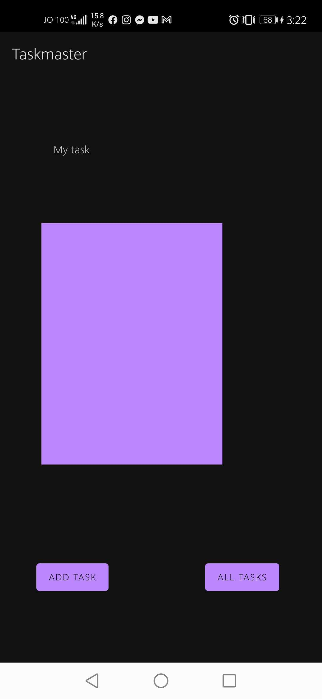
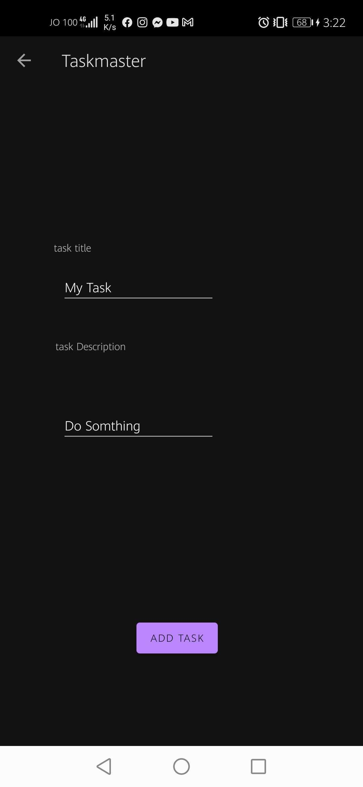
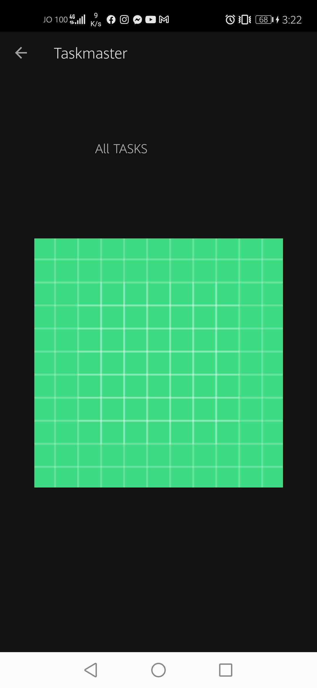

# taskmaster
## description :- Android application with 3 basic pages
### - Homepage : an image to mock the my tasks view, and buttons at the bottom of the page to allow going to the add tasks and all tasks page.

### - Add a Task : On the Add a Task page allow users to type in details about a new task, specifically a title and a body. When users click the submit button, show a submitted! label on the page.

### - All Tasks : The all tasks page should just be an image with a back button it needs no functionality.

